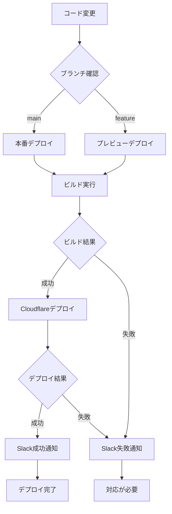

# Cloudflare Pages デプロイメントガイド

## 概要

BDiffアプリケーションをCloudflare Pagesに自動デプロイするためのCI/CDパイプラインです。

## デプロイメント設定

### 🌐 ドメイン情報
- **本番URL**: https://bdiff.v41.me
- **プレビューURL**: 自動生成 (PR毎)

### 🔐 必要な環境変数

GitHub Secretsに以下の環境変数を設定：

| 変数名 | 説明 | 取得方法 |
|--------|------|----------|
| `CLOUDFLARE_API_TOKEN` | CloudflareAPIトークン | Cloudflare Dashboard → My Profile → API Tokens |
| `CLOUDFLARE_ACCOUNT_ID` | CloudflareアカウントID | Cloudflare Dashboard → 右サイドバー |
| `SLACK_WEBHOOK_URL` | Slack通知用Webhook | Slack App → Incoming Webhooks |

### 📋 APIトークンの権限設定

Cloudflare APIトークンには以下の権限が必要：

```
Account: Cloudflare Pages:Edit
Zone: Zone:Read
Zone Resources: Include All zones
```

## ワークフロー詳細

### 🚀 トリガー条件

1. **本番デプロイ**: `main`ブランチへのプッシュ
2. **プレビューデプロイ**: Pull Requestの作成・更新

### 🔄 デプロイフロー



### 📝 ワークフロー手順

1. **チェックアウト**: リポジトリのコードを取得
2. **Node.js セットアップ**: Node.js 20をインストール
3. **依存関係インストール**: `npm ci`実行
4. **ビルド実行**: `npm run build`で最適化されたプロダクションビルド作成
5. **Cloudflareデプロイ**: `dist/`ディレクトリをCloudflare Pagesにデプロイ
6. **Slack通知**: 成功・失敗に応じた通知送信

## 通知機能

### 🔔 Slack通知の種類

#### 1. 本番デプロイ成功時
```
🚀 BDiff デプロイ成功

📝 詳細:
• 環境: Production (https://bdiff.v41.me)
• ブランチ: main
• コミット: abc1234
• 作成者: username

🔗 リンク:
• Live Site: https://bdiff.v41.me
• Commit: (GitHub URL)
• Action: (GitHub Action URL)
```

#### 2. プレビューデプロイ成功時
```
🔍 BDiff プレビューデプロイ成功

📝 詳細:
• 環境: Preview
• PR: #123 - 機能追加
• ブランチ: feature/new-feature
• 作成者: username
```

#### 3. デプロイ失敗時
```
❌ BDiff デプロイ失敗

📝 詳細:
• 環境: Production/Preview
• ブランチ: main/feature-branch
• 作成者: username

🛠️ 対応が必要です
```

### 💬 PR コメント

プレビューデプロイ成功時、自動的にPRにコメントが追加されます：

```markdown
🚀 Preview deployment successful!

Your changes have been deployed to a preview environment.

📝 Deployment Details:
- Environment: Preview
- Commit: abc1234
- Deploy Time: 2024-01-01 12:00:00 UTC

🔗 Links:
- Preview Site: https://bdiff.v41.me
- Action Run: (GitHub Action URL)

✅ Ready for review!
```

## トラブルシューティング

### ❌ よくあるエラー

#### 1. APIトークンエラー
```
Error: Authentication failed
```
**解決方法**: `CLOUDFLARE_API_TOKEN`の権限とスコープを確認

#### 2. ビルドエラー
```
Error: Build failed
```
**解決方法**: ローカルで`npm run build`を実行してエラーを特定

#### 3. アカウントIDエラー
```
Error: Account not found
```
**解決方法**: `CLOUDFLARE_ACCOUNT_ID`が正しく設定されているか確認

### 🔧 デバッグ手順

1. **GitHub Actions ログ確認**
   - リポジトリ → Actions タブ → 失敗したワークフロー確認

2. **Cloudflare ダッシュボード確認**
   - Pages → bdiff プロジェクト → デプロイメント履歴

3. **ローカル環境でのテスト**
   ```bash
   npm install
   npm run build
   # dist/ ディレクトリが正常に作成されるか確認
   ```

## セットアップ手順

### 1. GitHub Secrets設定

1. リポジトリ → Settings → Secrets and variables → Actions
2. "New repository secret"をクリック
3. 必要な環境変数を全て追加

### 2. Cloudflare Pages プロジェクト作成

1. Cloudflare Dashboard → Pages
2. "Create a project" → "Connect to Git"
3. GitHubリポジトリを選択
4. プロジェクト名: `bdiff`
5. ビルド設定は自動設定される

### 3. カスタムドメイン設定

1. Cloudflare Pages → bdiff → Custom domains
2. "Set up a custom domain"
3. `bdiff.v41.me`を入力
4. DNS設定を確認・更新

## パフォーマンス最適化

### 🚀 ビルド最適化

- **Code Splitting**: 自動的に実装済み
- **Asset Optimization**: Viteによる最適化
- **Compression**: Cloudflareによる自動圧縮

### 📊 監視とメトリクス

- **Core Web Vitals**: Cloudflare Web Analyticsで確認
- **Build Time**: GitHub Actions実行時間
- **Deploy Frequency**: デプロイメント履歴で確認

## セキュリティ

### 🔐 セキュリティベストプラクティス

- **Secrets管理**: GitHub Secretsで暗号化保存
- **最小権限**: APIトークンは必要最小限の権限のみ
- **HTTPS強制**: Cloudflareで自動有効化
- **CSP Header**: セキュリティヘッダー設定済み

### 🛡️ 追加のセキュリティ設定

```yaml
# _headers ファイルで追加設定済み
/*
  X-Frame-Options: DENY
  X-Content-Type-Options: nosniff
  Referrer-Policy: strict-origin-when-cross-origin
  Permissions-Policy: geolocation=(), microphone=(), camera=()
```

## まとめ

この設定により以下が実現されます：

- ✅ **自動デプロイ**: mainブランチプッシュ時
- ✅ **プレビュー環境**: PR作成時の自動プレビュー  
- ✅ **リアルタイム通知**: Slack統合
- ✅ **高可用性**: Cloudflareの世界規模CDN
- ✅ **セキュリティ**: HTTPS + セキュリティヘッダー
- ✅ **監視**: デプロイメント状況の可視化