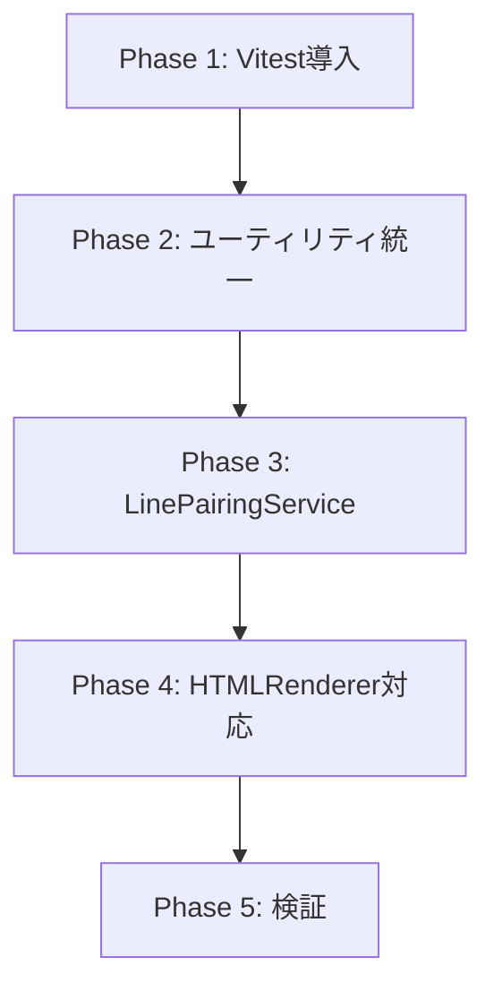

# Implementation Plan: 差分表示ロジックの共通化リファクタリング

**Branch**: `001-refactor-diff-common` | **Date**: 2026-02-06 | **Spec**: [spec.md](./spec.md)
**Input**: Feature specification from `/specs/001-refactor-diff-common/spec.md`

## Summary

画面表示（DiffViewer.tsx）とHTMLエクスポート（HTMLRenderer.ts）間で重複している差分表示ロジックを共通化する。主な対象は差分記号取得、HTMLエスケープ、行ペアリング、文字単位ハイライトの4機能。

## Technical Context

**Language/Version**: TypeScript 5.9.2
**Primary Dependencies**: React 19.1.1, Vite 7.1.5, Tailwind CSS 3.4.17
**Storage**: N/A（クライアントサイドのみ）
**Testing**: Vitest（新規導入）
**Target Platform**: Web (Modern browsers)
**Project Type**: Single（フロントエンドSPA）
**Performance Goals**: 既存パフォーマンスを維持（リグレッションなし）
**Constraints**: 既存の画面表示動作を変更しない
**Scale/Scope**: 5ファイルの重複排除、1ファイル新規作成

## Constitution Check

*GATE: Constitution未定義のためスキップ*

## Project Structure

### Documentation (this feature)

```text
specs/001-refactor-diff-common/
├── spec.md              # 仕様書
├── plan.md              # 本ファイル
├── research.md          # Phase 0 調査結果
├── data-model.md        # Phase 1 データモデル
└── quickstart.md        # Phase 1 クイックスタート
```

### Source Code (repository root)

```text
src/
├── utils/
│   ├── diffRendering.ts      # 統一先（getPrefixSymbol修正）
│   ├── diffStyling.ts        # getLineClass維持、getDiffSymbol削除
│   └── htmlEscape.ts         # 維持（既に共通）
├── services/
│   ├── charDiffService.ts    # 維持（HTMLRendererで流用）
│   ├── linePairingService.ts # 【新規作成】
│   ├── svgDiffRenderer.ts    # getPrefixSymbol削除→import
│   ├── htmlExportService.ts  # escapeHtml削除→import
│   └── export/renderers/
│       ├── BaseRenderer.ts   # getPrefixSymbol削除→import
│       └── HTMLRenderer.ts   # getDiffSymbol削除、CharDiff統合
├── components/diff/
│   └── DiffViewer.tsx        # ペアリングロジック→LinePairingService
└── types/
    └── types.ts              # LineWithSegments型追加

src/__tests__/               # 【新規ディレクトリ】
├── services/
│   ├── linePairingService.test.ts
│   └── charDiffService.test.ts
└── utils/
    └── diffRendering.test.ts
```

**Structure Decision**: 既存の単一プロジェクト構造を維持。テストファイルは`src/__tests__/`に配置。

## Implementation Phases

### Phase 1: テスト環境構築

1. Vitest導入（`npm install -D vitest jsdom`）
2. `vitest.config.ts`作成
3. `package.json`のtestスクリプト更新

### Phase 2: 共通ユーティリティ統一

1. `diffRendering.ts::getPrefixSymbol`のスペース削除
2. 各ファイルのimport追加・重複メソッド削除
   - `diffStyling.ts` → `getDiffSymbol`削除
   - `BaseRenderer.ts` → `getPrefixSymbol`削除
   - `HTMLRenderer.ts` → `getDiffSymbol`削除
   - `svgDiffRenderer.ts` → `getPrefixSymbol`削除
3. `htmlExportService.ts::escapeHtml`削除→`htmlEscape.ts`使用

### Phase 3: LinePairingService抽出

1. `linePairingService.ts`新規作成
2. DiffViewerからペアリングロジック移動
3. DiffViewerをLinePairingService使用に変更
4. ユニットテスト作成

### Phase 4: HTMLRenderer文字ハイライト対応

1. CharDiffServiceインポート追加
2. LinePairingServiceインポート追加
3. `renderCharSegments`メソッド実装
4. `generateUnifiedView`/`generateSideBySideView`修正
5. 埋め込みCSSに文字ハイライトスタイル追加

### Phase 5: 検証・クリーンアップ

1. 全テスト実行
2. ビルド確認（`npm run build`）
3. 手動検証（画面表示・HTMLエクスポート比較）
4. 不要コード削除確認

## Risk Analysis

| リスク | 影響度 | 対策 |
|--------|-------|------|
| 画面表示のリグレッション | 高 | Phase 3完了後に手動検証 |
| スペース有無による表示崩れ | 中 | Phase 2で統一後に全箇所確認 |
| HTMLエクスポートのスタイル差異 | 中 | Phase 4で埋め込みCSS調整 |

## Dependencies



## Complexity Tracking

なし（Constitution未定義のため違反なし）
